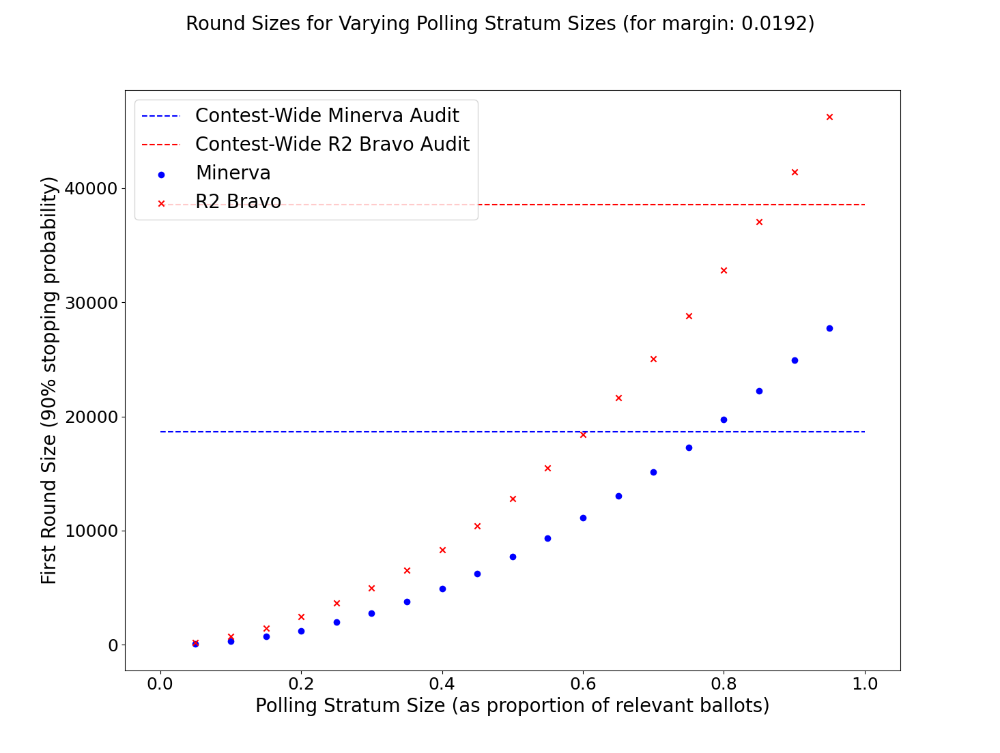

# stratified_athena

This repository is my exploratory work on stratified audits, under Professor Vora. Specifically I'm working on 2-strata audits that make use of the Athena class of ballot polling audits for the ballot polling stratum in order to increase the efficiency (and therefore feasability) of stratified audits.

A lot of this code is pulled straight from [the SUITE work](https://github.com/pbstark/CORLA18/tree/master/code) and some is pulled from [the minerva branch of r2b2](https://github.com/gwexploratoryaudits/r2b2/tree/minerva).

This code is messy and ugly. For now I more focused on getting things working and producing meaningful results, less focused on code ready to be integrated into r2b2....

Please ask me any questions that come up. obroadrick@gwu.edu

# examples

## Finding round sizes

Here is a plot illustrating the method I use to find the polling stratum round size that achieves a desired probability of stopping. Plotted over possible values for k (winner votes drawn in the round) are both the combined pvalue produced by that k (using 2-strata SUITE with Minerva for the polling stratum and a fixed 750 comparisons) as well as the probability of that k under the alternative hypothesis (a binomial distribution centered around the announced tally for the winner. All the numbers are based on the first example SUITE uses, a relatively tight margin of .0192.

From the plot, you can tell that this round size of 77 achieves a 90% probability of stopping because the value kmax such that Pr[k>=kmax | H_a] >= .9 and the pvalue corresponding to kmax is less than or equal to alpha (.1).

## Polling stratum round sizes 

Here is a plot of the ballot polling stratum minimum first round sizes that achieve 90% stopping probability for a 2-strata audit with ~2% margin, a fixed 750 ballots sampled in the comparison stratum, and various stratum sizes (on x-axis as percantage of total relevant ballots). Note that the 2-strata audit can reduce the number of ballots polled if a contest-wide polling audit were performed for significant polling stratum sizes (over half in this example). A tighter margin reduces the polling stratum size that still yields gains in efficiency, but even for this relatively tight race (~2% margin) more than half the relevant ballots can be in the polling stratum and still reduce the polling round size.

# Files in this repo (updated periodically)
###  audit_s.py
Audit class from r2b2, modified to handle null hypotheses of any margin. 

### ballot_comparison.py
Ballot comparison file from SUITE.

### contest.py
Contest file from r2b2.

### contest_wide_round_size_script.py
Script for computing and storing the round size for contest-wide ballot polling audits with no stratification (both Minerva and R2 Bravo).

### data
Directory with json files containing results from various tests, simulations, and computations of round sizes.

### dist_pvalues.py
Incomplete script for creating a plot of the probability distribution over possible pvalues for a stratified audit.

### easy_read.py
Simple script for printing data from the json data files.

### election.py
Election file from r2b2.

### fishers_combination.py
Fishers combination functions from SUITE.

### hypergeometric.py
Hypergeometric functions from SUITE. (Not used?)

### minerva_s.py
Minerva file from r2b2 modified to handle a null hypothesis with nonzero margin.

### old
Some files that are no longer used from when I first started exploring this topic, including some functions (incomplete) for more than two strata.

### plot_data.py
Script that produces a plot of round sizes from the json data files.

### pvalue_dist_script.py
Incomplete script that creates a plot of the probability distribution over pvalues for a stratified audit.

### __pycache__
This is a python thing.

### README.md
This file.

### round_sizes.py
Functions for computing a first round size which accomplishes a given probability of stopping under the alternative hypothesis, that the election is truly as announced.

### simulations.py
Functions for simulating stratified audits. Also includes my own functions for computing the pvalue for one-round Minerva audits and R2 Bravo audits.

### simulation_script.py
Script for running simulations of stratified audits.

### sprt.py
Functions for R2 Bravo from SUITE.

### stratified_round_size_script.py
Script to compute the round size which accomplishes a given probability of stopping for various one-round stratified audits.

